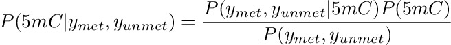
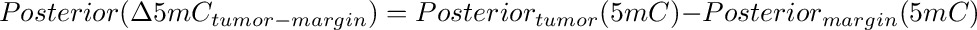
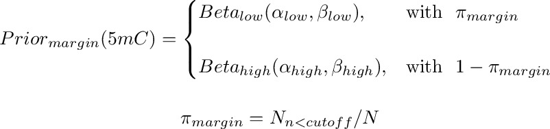
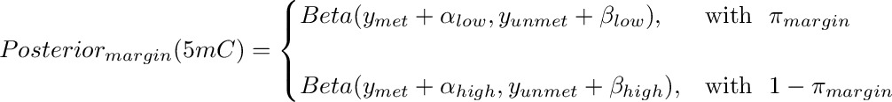

<!-- MarkdownTOC -->

- [Bayesian estimation of methylation and and differential methylation from bisulfite sequencing data](#bayesian-estimation-of-methylation-and-and-differential-methylation-from-bisulfite-sequencing-data)
    - [Abstract](#abstract)
    - [Introduction](#introduction)
    - [Method](#method)
    - [Results: Simulated data](#results-simulated-data)
    - [Results: Real data](#results-real-data)

<!-- /MarkdownTOC -->

<!--
Working dir and input files

Methylation files taken from Sergio. see `20150501_methylation_brain/20160209_regenerating_methylation_files.md`

cd /nas/sblab_data1/group_folders/berald01/projects/20150501_methylation_brain/20160613_bayes/
scp uk-cri-lcst01:/lustre/sblab/martin03/repository/20150921_BrainMethylomeRoadMap/methylation_cpg/ear04*BS.cpg.bedGraph.gz ./

-->

Bayesian estimation of methylation and and differential methylation from bisulfite sequencing data
==================================================================================================

Abstract
--------

Genome-wide cytosine methylation is typically detected through bisulfite sequencing whereby a count
for "methylated" and for "unmethylated" reads is assigned to each cytosine in the reference genome.
Consequently, differential methylation between pairs of samples can be assessed by simply applying a
Fisher test at each genomic position of interest. A limitation of the Fisher test is that by
assessing each position independently of the others,  the information from the global distribution
of methylation is ignored. Here, we present a Bayesian approach to the estimation of methylation and
differential methylation which uses the global distribution of methylation as prior distribution. By
updating this prior with the observed methylated and unmethylated counts, we obtain at each position
in each sample a posterior distribution that can be used to obtain credible intervals for
methylation and serves as input for differential methylation. We apply our approach to real and
simulated genomic data and show that our method achieves better performance over a Fisher test.

Introduction
------------

Genome-wide bisulfite sequencing is one of the most powerful strategies to quantify methylation
levels at several cytosines in a genome. This technique relies on bisulfite treatment to selective
convert of un-methylated cytosines to thymine while methylated cytosine remain unaffected.
Consequently, upon genome-wide sequencing and alignment it possible to infer the methylation level
in the genome by simply counting the number of aligned reads carrying C (*i.e.* methylated) or T
(*i.e.* un- methylated) at each genomic position where a cytosine is expected. By extension, it is
possible to  assess differential methylation at individual cytosines between one sample and another
by comparing  the number of C and T in each sample at each cytosine position. A straightforward
strategy to quantify  methylation in a single sample and differential methylation between a pair of
samples is to apply a binomial test or a Fisher test, respectively, at each position of interest.
One limitation of these approaches is that by testing each position independently they ignore the
information from the genome-wide distribution of methylation. Here, we present a bayesian approach
to  detect methylation and differential methylation which uses the genome wide distribution of
methylation  within a sample as prior distribution. By upgrading the prior with the observed C and T
counts we obtain posterior  distributions which can be used either as such to infer credibility intervals 
for methylation or as input for differential methylation analysis. By comparing our approach against
a Fisher test on simulated data, we show and improvement in the detection of methylation.

Base | Read out
-----|---------
C    |  T 
5mC  |  C

Method
------

The difference in methylation between tumor and margin can be estimated independently for each
cytosine (or each CpG or any other testable unit) by means, for example, of a Fisher test. This
strategy, however, ignores the information from the genome-wide distribution of methylation in tumor
and margin, thus resulting in a loss of power and in large differences especially where the read
counts are small and affected by large sampling variance.

Here we propose a Bayesian approach to the estimate of methylation and difference in methylation
that makes use of the genome wide distribution of methylation as prior distribution. At each CpG,
this prior distribution is updated by the observed counts at the tested CpG to produce a posterior
distribution. The mode of the posterior distribution is thus the estimated level of methylation.
Finally, the differences between tumor and margin posteriors yield the posterior distributions of
methylation differences. The posterior distribution thus obtained can be directly used to estimate
*credibility intervals*, that is the interval which contains the true methylation (or difference in
methylation) with a given probability.

In this context, the probability of methylation percentage at a given CpG in a library (either tumor or margin) is

where *ymet* and *yunmet* are the observed counts methylated and un-methylated at the tested CpG.
The difference in methylation can be obtained by subtracting the margin from tumor:

The genome wide distribution of 5mC at CpG sites is markedly bimodal in both tumor or margin (see below). Therefore, the prior
distribution reflecting this bimodality was approximated by a mixture of two beta distributions, one beta distribution for the lower mode
and one for the upper mode. These two distributions are mixed according to the number of CpG whose methylation falls above or below a given cut-off.
Since the beta distribution is defined between 0 and 1 and can take different shapes depending on the two parameters α and β, the beta seems a natural choice to model the distribution of 5mC. The prior for the *margin* is represented here below (the prior for the tumor is analogous):

where π is the proportion of CpG below the chosen cut-off.

The posterior distribution of 5mC at each CpG is a beta distribution obtained by updating the prior with the observed read counts:

The posterior distribution can be used directly to obtain the most likely value of methylation (*e.g.* by extracting
the mean, mode and the quantiles of interest) and to produce credibility intervals. The difference in methylation between tumor and
margin is obtained by subtracting one posterior from the other. Again, the resulting distribution can be used to
extract statistics of interest like mode and quantiles of the differential methylation

As shown below, priors, posteriors and differences are computed by simulation.

Results: Simulated data
-----------------------

Results: Real data
------------------

[Results: Real data](../20160808_RealTumorVsMargin/README.md)

